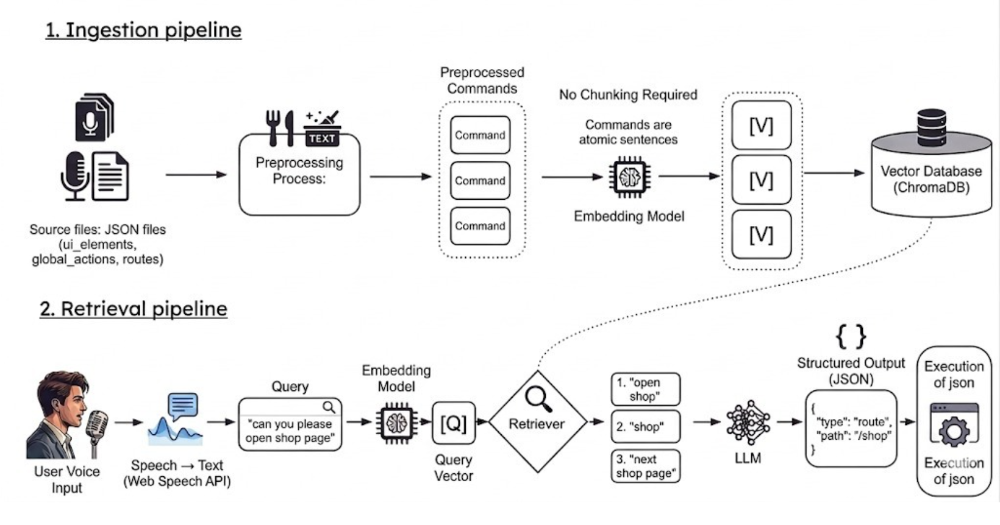

# InclusiKart - Where Ability Meets Opportunity
An inclusive digital platform that empowers persons with disabilities to earn independently by selling verified products, sharing stories, and accessing support services.
InclusiKart features voice-enabled navigation and multilingual support to ensure accessible interaction for users with diverse abilities, while connecting disabled creators, buyers, NGOs, and administrators in a secure and inclusive ecosystem.

---

## Project Vision

Many talented individuals with disabilities lack access to digital platforms to showcase their skills and earn independently. InclusiKart bridges this gap by:

* Enabling verified disabled individuals to sell handmade and creative products
* Allowing users to share inspiring personal stories
* Providing a structured way to request help such as donations or raw materials

---

## Key Features

### User (Seller)
* User registration and login
* Profile verification using government-issued documents
* Sell products after admin verification
* Share personal stories after moderation
* Request help:
  * Receive donations
  * Request raw materials
* View status of submitted products, stories, and requests

### Buyer
* Register and log in
* Browse and purchase products listed by verified sellers
* Read inspiring stories shared by disabled individuals

### Admin
* Verify user profiles
* Approve or reject product listings
* Moderate and approve stories
* Manage donation and raw material requests

---

##  Accessibility Features

* Voice navigation for hands-free interaction
* Multilingual Support

-----
<!-- 
## Voice Navigation Architecture: RAG-Powered Command Processing

---

Watch the demo here:  https://drive.google.com/file/d/1WntAv3C5LM_X9vN6_nYecmi7o4J5DiwY/view?usp=sharing

### 1. Ingestion Pipeline
* **Source Files:** Ingests raw configuration data from `ui_elements`, `global_actions`, and `routes` JSON files.
* **Preprocessing:** Flattens JSON and extracts human-readable text labels while attaching essential metadata like element IDs and paths.
* **Preprocessed Commands:** Organizes data into atomic, single-sentence commands, eliminating the need for traditional document chunking.
* **Embedding Model:** Utilizes `all-MiniLM-L6-v2` to convert each command text into a 384-dimensional semantic vector.
* **Vector Database:** Stores these numerical embeddings in **ChromaDB** to enable high-speed similarity searching based on cosine similarity.

### 2. Retrieval Pipeline
* **User Voice Input:** Captures real-time audio from the user through the application's microphone interface.
* **Speech-to-Text:** Converts the spoken audio into a raw text string using the browser's native **Web Speech API**.
* **Query Embedding:** Processes the converted text through the same embedding model to create a real-time "Query Vector."
* **Retriever:** Searches ChromaDB to find the **Top-K (k=3)** most semantically similar commands stored in the database.
* **LLM Reasoning:** Passes the user's query and retrieved matches to **Llama-3.1-8b (via Groq)** to determine the exact user intent.
* **Structured Output:** The LLM generates a precise **JSON object** containing the specific action type and target path (e.g., `"/shop"`).
* **Execution:** The system parses the JSON output and instantly triggers the corresponding navigation or UI action within the app.

---
-->

## Tech Stack

### Frontend
* React JS
* Tailwind CSS

### Backend
* Node.js
* Express.js

### Database
* MongoDB

### External Services
* Razorpay - payment gateway integration
* Twilio - Notifications
* Google Translator - Multilingual Support
* Cloudinary - Media Storage
* Open Street Map - Location services

